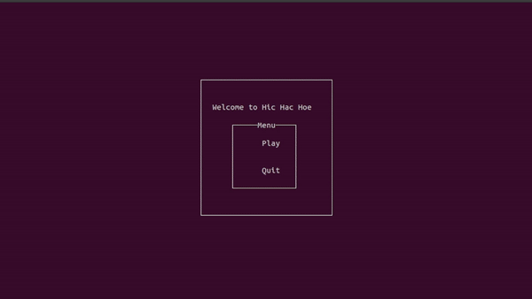

# hic-hac-hoe
This is my first haskell project, feedbacks on source code very welcomed! Currently, this game only runs with `ghc`.

See the [backlog](https://github.com/BlastWind/hic-hac-hoe/issues/5) for interesting features I plan to add to this toy.

## Current State

